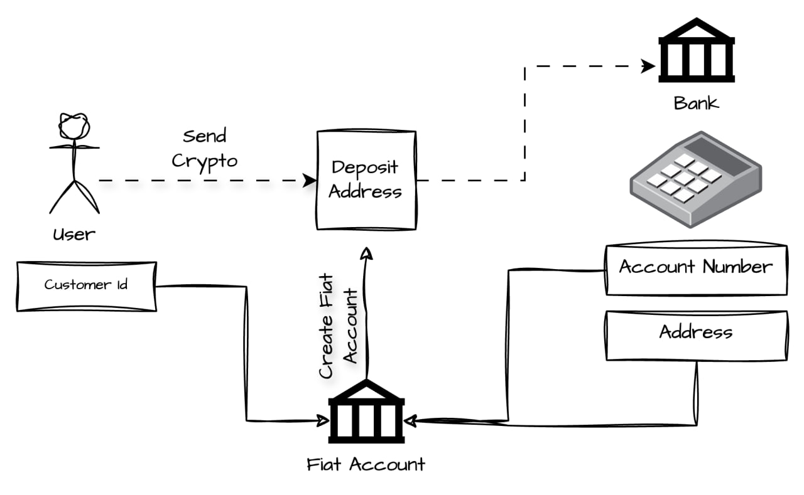

<h1 align="center">API Integration</h1>

<h4 align="center">
  <a href="https://ethglobal.com/">ETHGlobal</a> | <a href="https://ethglobal.com/">Website</a>
  <br><br>
  <span style="font-weight: 300; font-style: italic;">Note: Everything in blue is a clickable link.</span>
  <br>
  <span style="font-weight: 300; font-style: italic;">Please use Node.js's Latest Version</span>
  <br><br>
  
</h4>

---

## Project Overview

This project demonstrates the integration of the GateFi API to manage customer data, fiat accounts, and deposits using Express.js, Axios, and environment variables for secure API key management.

### Key Features:
- **Create Customer**: Register a new customer with their email and phone number.
- **Create Fiat Account**: Set up a new fiat account tied to a specific customer.
- **Create Deposit**: Execute deposit operations and receive relevant quotes for a transaction.

---

## Environment Configuration (.env)

Make sure to create a `.env` file at the root of your project and define the following variables:

- `SECRET_KEY`: The secret key used to generate signatures for API requests.
- `API_KEY`: The API key used for authenticating with GateFi's external services.

```bash
SECRET_KEY=your_secret_key_here
API_KEY=your_api_key_here
```

DIAGRAM OF APP

  

<br>
We use User's Customer Id and POS's Account number to simplify process for merchant, meaning merchant wont have to complete KYC in order to receive funds!
<br><br>


---

## API Endpoints


### 1. Create New Customer
**POST** `/newCustomer`

Creates a new customer in GateFi.

#### Request Body:
```json
{
  "email": "customer@example.com",
  "phoneNumber": "+123456789"
}
```

#### Response:
```json
{
  "customerId": "12345",
  "createdAt": "2024-10-01T12:00:00Z"
}
```

### 2. Create New Fiat Account
**POST** `/newFiatAccount`

Creates a new fiat account for the specified customer.

#### Request Body:
```json
{
  "customerId": "12345",
  "accountNumber": "DE1234567890",
  "recipientFullAddress": "123 Main St, City, Country",
  "recipientAddressCountry": "Germany"
}
```

#### Response:
```json
{
  "fiatAccountId": "abc123",
  "createdAt": "2024-10-01T12:00:00Z",
  "bankName": "Example Bank"
}
```

### 3. Create New Deposit
**POST** `/newDeposit`

Executes a deposit operation for a customer.

#### Request Body:
```json
{
  "customerId": "12345",
  "chain": "TRX",
  "fromAmount": "1000",
  "fromCurrency": "USD",
  "toCurrency": "EUR",
  "fiatAccountId": "abc123",
  "amount": "950"
}
```

#### Response:
```json
{
  "depositId": "deposit123",
  "createdAt": "2024-10-01T12:00:00Z"
}
```

---

## Running the Project

To install the required dependencies and run the server, follow these steps:

### 1. Install Dependencies:
```bash
npm install
```

### 2. Start the Server:
```bash
node app.js
```

The server will be running on `http://localhost:3001`.

---

## Technologies Used

- **Express.js**: Web framework for building the API.
- **Axios**: To handle HTTP requests to the GateFi API.
- **crypto**: For generating secure HMAC signatures.
- **dotenv**: For environment variable management.

---

Built for ETHGlobal 2024 🎉
